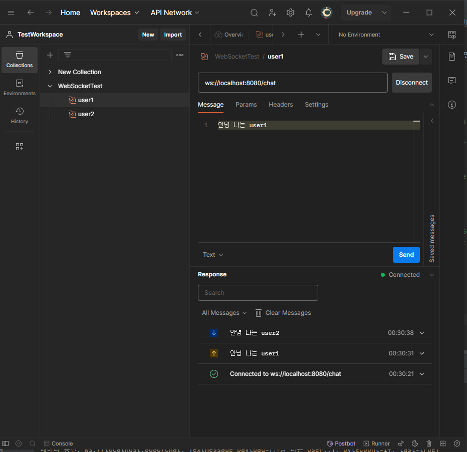

# 채팅 시스템

   
### 1. WebSocket 기본 구현
WebSocket 만을 사용한 기본적인 형태로 채팅이나 송수신자에 대한 구분이 없이 접속되어 있는 모든 사용자에게 메세지를 보낸다.   
참고: https://docs.spring.io/spring-framework/reference/web/websocket/server.html

#### 1-1. WebSocket 의존성 추가   
- build.gradle
```
implementation 'org.springframework.boot:spring-boot-starter-websocket'
```   

#### 1-2. WebSocketHandler 구현   
간단하게 구현해보기 위해 스프링 문서와 같이 ```TextWebSocketHandler```를 상속해서 필요한 메서드만 재정의하였다.   
WebSocketSession의 id를 Key로 Map에 담아두고 서버에서 클라이언트로 메세지를 보낼 때 맵에 있는 모든 세션에 데이터를 전송하도록 처리했다. 

- ChatWebSocketHandler
```
@Component
public class ChatWebSocketHandler extends TextWebSocketHandler {

    // 관리할 세션
    private final Map<String, WebSocketSession> sessions = new HashMap<>();

    // 연결 성공
    @Override
    public void afterConnectionEstablished(WebSocketSession session) throws Exception {
        sessions.put(session.getId(), session);

        MessageDto messageDto = MessageDto.builder()
                .messageId(session.getId())
                .sendAt("now")
                .content("사용자가 연결되었습니다.")
                .build();

        // messageDto DB save

        // 모든 세션에 사용자 연결 알림 전송 (본인 제외)
        sessions.values().forEach(s-> {
            if(!s.getId().equals(messageDto.getMessageId())) {
                try {
                    s.sendMessage(new TextMessage(messageDto.getContent()));
                } catch (IOException e) {
                    System.out.println("오류 발생 !! " + e.getLocalizedMessage());
                }
            }
        });
    }

    // 클라이언트에서 데이터 수신
    @Override
    protected void handleTextMessage(WebSocketSession session, TextMessage message) throws Exception {
        MessageDto messageDto = MessageDto.builder()
                .messageId(session.getId())
                .sendAt("now")
                .content(message.getPayload())
                .build();

        // messageDto DB save

        // 모든 세션에 데이터 전송 (본인 제외)
        sessions.values().forEach(s-> {
            if(!s.getId().equals(messageDto.getMessageId())) {
                try {
                    s.sendMessage(new TextMessage(messageDto.getContent()));
                } catch (IOException e) {
                    System.out.println("오류 발생 !! " + e.getLocalizedMessage());
//                    throw new RuntimeException(e);
                }
            }
        });
    }

    // 연결 종료
    @Override
    public void afterConnectionClosed(WebSocketSession session, CloseStatus status) throws Exception {
        System.out.println("웹소켓 종료: " + session.getUri() + ", " + status);

        // 연결 종료 시 세션 삭제
        sessions.remove(session.getId());
    }
}
```

#### 1-3. WebSocketConfiguration 작성   
```WebSocketConfigurer ``` 를 구현해서 1-2 에서 만들어둔 ```WebSocketHandler```를 사용하기 위한 설정을 해준다.  
/chat 으로 들어온 요청은 ```WebSocketHandler```를 사용해서 처리한다.

```
@Configuration
@EnableWebSocket
public class WebSocketConfiguration implements WebSocketConfigurer {

    private final ChatWebSocketHandler handler;

    @Autowired
    public WebSocketConfiguration(ChatWebSocketHandler handler) {
        this.handler = handler;
    }

    @Override
    public void registerWebSocketHandlers(WebSocketHandlerRegistry registry) {
        registry.addHandler(handler, "/chat");
    }
}
```
   
#### 1-4. 테스트
postman 을 사용해 간단한 테스트를 해볼 수 있다.   
(New 버튼 > WebSocket 선택)
- 사용자1


- 사용자2

